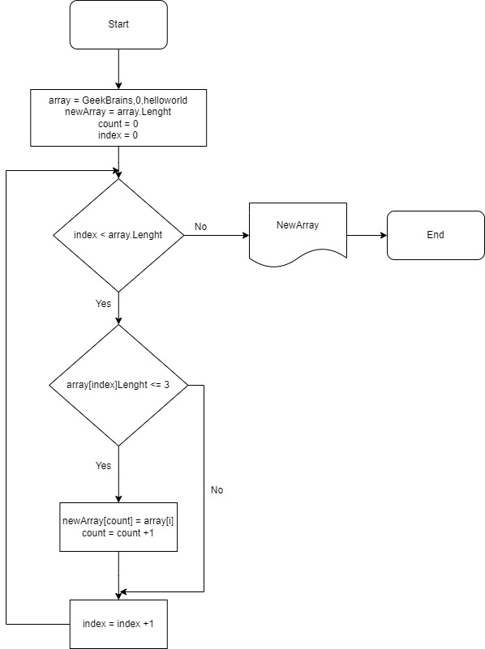

## Начало

У нас задан массив(array) с символами;

И есть новый массив(newArray) который равен длине массива(array.Lenght);

Есть переменаная count котрая равна 0 ;

И индекс который равен 0;

*Цикл*
Если индекс меньше чем длина массива: NO то вывод нового массива и конец,Yes Если массив с индексом длины меньше либо равен 3,NO индекс +1,Yes новый массив каунт равен массиву индекса,каунт +1

